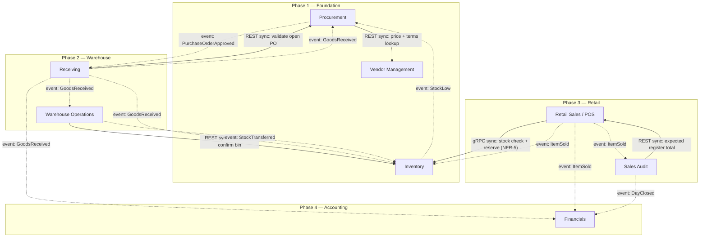

# Merchandising Funnel Automation — Merchandise Management System (MMS)

A distributed Merchandise Management System for a retail business that buys goods from suppliers, stores them in a warehouse, and sells them across physical stores. Today that business runs on spreadsheets, paper receipts, and manual data entry — nobody trusts the stock count, purchase orders have no audit trail, goods get signed for without verification, and the books are always weeks behind. This system replaces that with eight independently deployable backend services — each owning one business domain and its own database — coordinating over REST, gRPC, and an event bus, plus the frontend each domain needs.

Specified against a furniture retailer (one central warehouse, multiple showrooms, starting in Eldoret) — see [`docs/01-product-requirements.md`](docs/01-product-requirements.md) §1.3. The module set applies unchanged to any similar retail vertical.

**Source documents** (read these first if you're changing requirements, not just implementing them):

- [`docs/00-source-of-truth.md`](docs/00-source-of-truth.md) — the original capstone brief. Authoritative on architecture mandates and non-negotiables.
- [`docs/01-product-requirements.md`](docs/01-product-requirements.md) — the PRD derived from it: FR-x.x requirements per module, a cross-module interaction table, and a **Decisions Log (§9)** resolving every judgment call the brief left open. Where the two could differ, the PRD's FR numbers are what's implemented.

---

## Architecture



Solid arrows are synchronous request/reply (REST, or gRPC on the one latency-sensitive path). Dashed arrows are async domain events published to a shared RabbitMQ topic exchange (`mms.events`) — the publisher never knows or cares who's listening, and a downed consumer just finds its events waiting in its own durable queue when it comes back (NFR-3).

**Database isolation is enforced, not just conventional.** Each service gets its own Postgres role and database (`docker/postgres-init/init-databases.sh`), and `PUBLIC` connect access is revoked — a service's credentials physically cannot open a connection to another service's database, even though all 8 databases share one Postgres container for local-dev convenience (NFR-1).

**Why gRPC only on one path:** every other sync call is REST/JSON — human-readable, browser-accessible, good for dashboards and general server-to-server reads. The Retail Sales → Inventory stock check at checkout is the one path where a customer is standing at a register waiting (NFR-5), so it's Protobuf/gRPC (`contracts/proto/inventory.proto`) instead.

---

## Module directory

| Module | Directory | Purpose | Phase | Status |
|---|---|---|---|---|
| Vendor Management | [`services/vendor-management`](services/vendor-management) | Authoritative supplier record: contacts, terms, product catalogs, reliability history | 1 — Foundation | ✅ Implemented |
| Procurement | [`services/procurement`](services/procurement) | PO lifecycle, value-based approval workflow, reorder suggestions | 1 — Foundation | ✅ Implemented |
| Inventory | [`services/inventory`](services/inventory) | Stock levels (On Hand/Allocated/Available), valuation, checkout stock-check (gRPC) | 1 — Foundation | ✅ Implemented |
| Receiving | [`services/receiving`](services/receiving) | Match deliveries to POs, flag discrepancies, generate GRNs | 2 — Warehouse | ✅ Implemented |
| Warehouse Operations | [`services/warehouse-operations`](services/warehouse-operations) | Putaway/picking direction, transfers, space utilization | 2 — Warehouse | ✅ Implemented |
| Retail Sales (POS) | [`services/retail-sales`](services/retail-sales) | Checkout, pricing/promotions, returns, payment capture | 3 — Retail | 🚧 Scaffold only |
| Sales Audit | [`services/sales-audit`](services/sales-audit) | Store-level cash reconciliation, discrepancy sign-off | 3 — Retail | 🚧 Scaffold only |
| Financials | [`services/financials`](services/financials) | Automated ledger entries, AP, revenue/gross-profit reporting | 4 — Accounting | 🚧 Scaffold only |

Each backend module pairs with a frontend under [`frontends/`](frontends), gated by the same phase flag:

| Frontend | Directory | For module |
|---|---|---|
| Vendor Management Portal | [`frontends/vendor-management-portal`](frontends/vendor-management-portal) | vendor-management |
| Procurement Dashboard | [`frontends/procurement-dashboard`](frontends/procurement-dashboard) | procurement |
| Inventory Control Center | [`frontends/inventory-control-center`](frontends/inventory-control-center) | inventory |
| Warehouse Receiving App | [`frontends/warehouse-receiving-app`](frontends/warehouse-receiving-app) | receiving |
| Warehouse Floor App | [`frontends/warehouse-floor-app`](frontends/warehouse-floor-app) | warehouse-operations |
| Point of Sale Terminal | [`frontends/pos-terminal-app`](frontends/pos-terminal-app) | retail-sales |
| Store Manager Dashboard | [`frontends/store-manager-dashboard`](frontends/store-manager-dashboard) | sales-audit |
| Finance Portal | [`frontends/finance-portal`](frontends/finance-portal) | financials |

"Scaffold only" means: the service boots, exposes `/health`, has a Prisma schema stub (`Placeholder { id, createdAt }`), and a Dockerfile — but every other route and event listener 503s / stays unregistered until its feature flag is turned on. See [Feature Flags](#feature-flag-configuration) below.

---

## Monorepo layout

```
merchandising-funnel-automation/
├── docs/                        # the brief + PRD — read these first
├── contracts/
│   ├── openapi/                 # one YAML per REST-exposing service (contract-first, NFR-4)
│   └── proto/inventory.proto    # the one gRPC contract in the system
├── libs/shared/                 # event-bus client, domain event types, feature-flag helpers — no business logic
├── services/                    # 8 NestJS backends, one per domain, one private DB each
├── frontends/                   # 8 Next.js apps, one per module
├── docker/postgres-init/        # per-service DB role/isolation bootstrap
├── scripts/generate-proto.sh    # optional ts-proto codegen (NestJS loads the .proto at runtime either way)
├── docker-compose.yml           # Postgres + RabbitMQ + all 8 service containers
└── .github/workflows/ci.yml     # lint, build, unit tests, then integration tests against real infra
```

**Stack:** TypeScript, pnpm workspaces · NestJS + Prisma (Postgres) · REST/OpenAPI via `@nestjs/swagger` · gRPC/Protobuf via `@nestjs/microservices` (Inventory checkout path only) · RabbitMQ via a shared topic exchange (`mms.events`) · Next.js (App Router) · Docker Compose · GitHub Actions.

---

## Local development setup

**Prerequisites:** Node `20.17.x` (see `.nvmrc`), pnpm ≥ 9, Docker + Docker Compose.

```bash
# 1. Install workspace dependencies
pnpm install

# 2. Copy env files
cp .env.example .env
# each service also has its own services/<name>/.env.example for running
# outside Docker — copy those too if you're running `pnpm dev` directly.

# 3. Generate each service's Prisma client (isolated per service — see below)
for svc in vendor-management procurement inventory receiving warehouse-operations retail-sales sales-audit financials; do
  pnpm --filter "@mms/${svc}" exec prisma generate
done

# 4. Bring up Postgres, RabbitMQ, and all 8 backend services
docker compose up --build

# 5. (separately) run any frontend you need
cd frontends/procurement-dashboard && cp .env.example .env.local && pnpm dev
```

Once up:

- Vendor Management — REST http://localhost:3001, Swagger UI at `/docs`
- Procurement — REST http://localhost:3002, Swagger UI at `/docs`
- Inventory — REST http://localhost:3003 (`/docs`), gRPC on `:5003`
- Receiving — REST http://localhost:3004 (`/docs`)
- Warehouse Operations — REST http://localhost:3005 (`/docs`)
- Retail Sales / Sales Audit / Financials — REST on `:3006`–`:3008`, `/health` only until their phase ships
- RabbitMQ management UI — http://localhost:15672 (see `.env.example` for credentials)
- Frontends — `:3101`–`:3108` (see each app's own port in `.env.example`)

**Why `prisma generate` is a manual step, not baked into `pnpm install`:** every service generates its own **isolated** Prisma Client (`output = "../src/generated/prisma"` in each `prisma/schema.prisma`) instead of the package-default location. Without this, pnpm's dependency deduplication collapses all 8 services' identical `@prisma/client` version into one physical `node_modules` location, and the last service to run `prisma generate` silently overwrites every other service's generated client. Each service must generate its own.

**Database isolation:** `docker/postgres-init/init-databases.sh` runs once, automatically, the first time the `postgres` container starts with an empty data volume. It creates one login role and one database per service and revokes default `PUBLIC` connect access, so — even though local dev runs one Postgres container for convenience — a service's credentials can only ever reach its own database (NFR-1). To re-run it (e.g. after changing service passwords), remove the `postgres-data` volume: `docker compose down -v`.

**Migrations:** this scaffold ships no committed migration history yet — `docker-compose.yml` runs `prisma db push` (schema sync, no migration files) on container start for local-dev convenience. Once a service's schema stabilizes, switch it to `prisma migrate dev` (commit the generated `prisma/migrations/`) and `prisma migrate deploy` in production/CI, per standard Prisma workflow.

---

## Feature flag configuration

Every module — service and frontend — is gated by an env-var feature flag, defaulting to its PRD phase (`libs/shared/src/feature-flags/module-phase.ts`):

| Flag | Default | Phase |
|---|---|---|
| `FEATURE_VENDOR_MANAGEMENT_ENABLED` | `true` | 1 |
| `FEATURE_PROCUREMENT_ENABLED` | `true` | 1 |
| `FEATURE_INVENTORY_ENABLED` | `true` | 1 |
| `FEATURE_RECEIVING_ENABLED` | `true` | 2 |
| `FEATURE_WAREHOUSE_OPERATIONS_ENABLED` | `true` | 2 |
| `FEATURE_RETAIL_SALES_ENABLED` | `false` | 3 |
| `FEATURE_SALES_AUDIT_ENABLED` | `false` | 3 |
| `FEATURE_FINANCIALS_ENABLED` | `false` | 4 |

**Backend:** each service applies `FeatureFlagGuard.forModule(ModuleKey.X)` globally in its `main.ts`. `/health` always responds (so orchestration/monitoring can see the container is up); every other route 503s with `{ message: "... not yet implemented" }` while the flag is off. Event consumers check `isModuleEnabled(...)` in their own `onModuleInit` before subscribing, so a disabled module doesn't drain events meant for it off the queue.

**Frontend:** each Next.js app reads its own `NEXT_PUBLIC_FEATURE_X_ENABLED` (mirroring the backend flag name) and renders a "coming soon" screen instead of its real page when it's off.

**To turn a module on:** flip its flag to `true` in `.env` (root, for Docker) and in that service's/frontend's own `.env`/`.env.local` (for `pnpm dev`), then restart it. Turning a module on before its backend is actually implemented just means `/health` plus 503s everywhere else — implement the module, then flip the flag as the last step of that PR (see `CONTRIBUTING.md`'s Definition of Done).

---

## Testing

```bash
# Unit tests — no external services required
pnpm run test                              # every package
pnpm --filter @mms/inventory run test      # one service

# Integration/e2e tests — require Postgres + RabbitMQ running
docker compose up -d postgres rabbitmq
pnpm --filter @mms/vendor-management exec prisma db push --skip-generate
pnpm --filter @mms/vendor-management run test:e2e
```

CI (`.github/workflows/ci.yml`) runs both: a fast `lint-build-unit-test` job on every PR (no external services), then an `integration-test` job that spins up real Postgres + RabbitMQ service containers, applies each service's schema, and runs its `test:e2e` suite — reusing the same `docker/postgres-init/init-databases.sh` isolation setup as local dev.

---

## API documentation

- **REST:** each service serves live Swagger UI at `/docs` (e.g. http://localhost:3001/docs) once running, generated from its `@nestjs/swagger` decorators. The committed, contract-first source of truth lives in [`contracts/openapi/`](contracts/openapi) — one YAML per service, written before the corresponding business logic per NFR-4.
- **gRPC:** [`contracts/proto/inventory.proto`](contracts/proto/inventory.proto) is the sole source of truth for the Retail Sales → Inventory stock-check contract. NestJS loads it directly at runtime (no codegen required to run); `pnpm run proto:generate` (ts-proto) is available if you want fuller generated TS bindings, but is optional.

---

## Contributing

Branch naming, PR scope, and the per-module Definition of Done live in [`CONTRIBUTING.md`](CONTRIBUTING.md). Short version: one module or one significant feature per PR, feature-flagged correctly for its phase, contracts updated alongside the code, tests green in CI, this README's module table updated if a module's status changed.

## License

[MIT](LICENSE)
